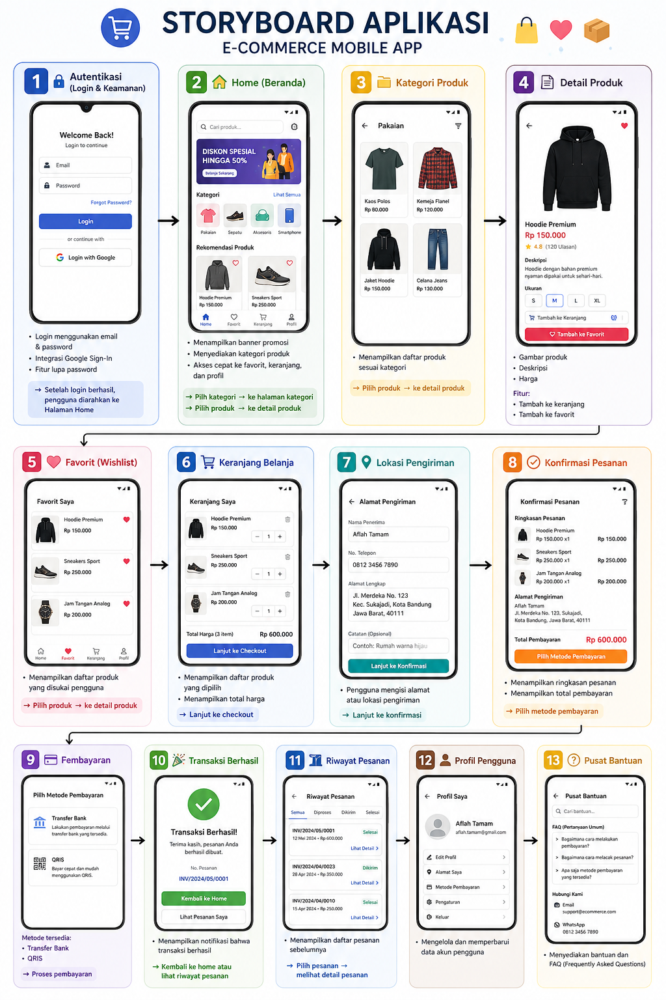

# 🛍️ E-Commerce Mobile App
### Modern Android E-Commerce Application 🚀

 

 <!-- ⛔ WAJIB DITUTUP DI SINI -->

---

## 🛍️ E-Commerce Mobile App (Android Studio)

A modern Android-based mobile application designed to implement a complete **E-Commerce system**, covering end-to-end user interactions — from authentication and product browsing to cart management, checkout, and payment processing.

---

## 🚀 Key Features

### 🔐 Authentication System
Secure login with:
- Email & password
- Google Sign-In integration
- Password recovery (Forgot Password)

### 🏠 Home & Product Navigation
- Interactive home screen
- Product categories for easy browsing
- Seamless navigation experience

### 📂 Product Categories
- Clothing
- Shoes
- Accessories
- Smartphones

### 📄 Product Details
- Product images  
- Detailed descriptions  
- Pricing information  

### ❤️ Favorites (Wishlist)
- Save favorite products  
- Quick access  

### 🛒 Shopping Cart
- Add items  
- Update quantity  
- Manage products  

### 📍 Shipping Address
- Add & edit address  
- Manage locations  

### ✅ Order Confirmation
- Review order  
- Verify before payment  

### 💳 Payment
- Bank Transfer  
- QRIS  

### 🎉 Transaction Status
- Success notification  
- Payment feedback  

### 📦 Order History
- Track orders  
- View details  

### 👤 User Profile
- Update data  
- Manage account  

### 🆘 Help Center
- FAQ  
- Support  

---

## 📱 Storyboard Aplikasi

### 🔐 1. Autentikasi (Login & Keamanan)
Pengguna dapat mengakses aplikasi melalui:
- Login menggunakan email & password
- Integrasi Google Sign-In
- Fitur lupa password (Forgot Password)

➡️ Setelah login berhasil, pengguna diarahkan ke **Halaman Home**

---

### 🏠 2. Home (Beranda)
Halaman utama sebagai pusat navigasi:
- Banner promosi
- Kategori produk
- Akses cepat:
  - ❤️ Favorit
  - 🛒 Keranjang
  - 👤 Profil

➡️ Pilih kategori → **Halaman Kategori Produk**  
➡️ Pilih produk → **Detail Produk**

---

### 📂 3. Kategori Produk
Produk dikelompokkan menjadi:
- Pakaian
- Sepatu
- Aksesoris
- Smartphone

➡️ Menampilkan daftar produk sesuai kategori  
➡️ Pilih produk → **Detail Produk**

---

### 📄 4. Detail Produk
Menampilkan informasi lengkap:
- Gambar produk
- Deskripsi
- Harga

Fitur:
- Tambah ke keranjang 🛒
- Tambah ke favorit ❤️

---

### ❤️ 5. Favorit (Wishlist)
- Menampilkan produk yang disukai pengguna

➡️ Pilih produk → **Detail Produk**

---

### 🛒 6. Keranjang Belanja
- Daftar produk yang dipilih
- Total harga

➡️ Lanjut ke **Checkout**

---

### 📍 7. Lokasi Pengiriman
- Input alamat pengiriman

➡️ Lanjut ke **Konfirmasi Pesanan**

---

### ✅ 8. Konfirmasi Pesanan
- Ringkasan pesanan
- Total pembayaran

➡️ Pilih metode pembayaran

---

### 💳 9. Pembayaran
Metode yang tersedia:
- Transfer Bank
- QRIS

➡️ Proses pembayaran

---

### 🎉 10. Transaksi Berhasil
- Notifikasi transaksi sukses

➡️ Kembali ke **Home** atau ke **Riwayat Pesanan**

---

### 📦 11. Riwayat Pesanan
- Daftar pesanan sebelumnya

➡️ Pilih pesanan → **Detail Pesanan**

---

### 👤 12. Profil Pengguna
- Mengelola dan memperbarui data akun

---

### 🆘 13. Pusat Bantuan
- FAQ (Frequently Asked Questions)
- Dukungan pengguna

---

## 📱 Preview Aplikasi

### 🧩 Storyboard

  

### 🔄 Alur Sistem

  

### 🚀 Thanks for Visiting!

💡 *"Building something useful is better than building something perfect."*

⭐ Jangan lupa kasih star kalau project ini membantu!

